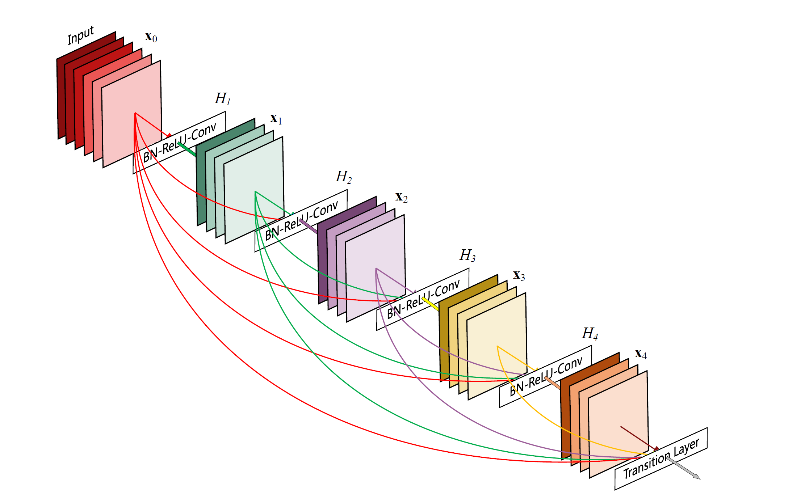

# DenseNet-121 Implementation 

Dataset: Cifar100

<!--  -->

###  TODO
* [ ] Provide proper documentation in README.md
* [ ] Rerun with cifar100 and present the accuracy and loss for train, validation and test
* [ ] Implement DenseNet-169, DenseNet-201 and DenseNet-264 (report the evaluation respectively)
* [ ] Report the difference in performance between DenseNet and my previous vanilla CNN implemention w.r.t cifar100.
* [ ] Implement with @tf.function to speed things up (both training and testing)
---

Reference:

1. Huang, Gao, et al. “Densely Connected Convolutional Networks.” ArXiv:1608.06993 [Cs], Jan. 2018. arXiv.org, http://arxiv.org/abs/1608.06993.

2. https://github.com/Machine-Learning-Tokyo/CNN-Architectures/tree/master/Implementations/DenseNet

